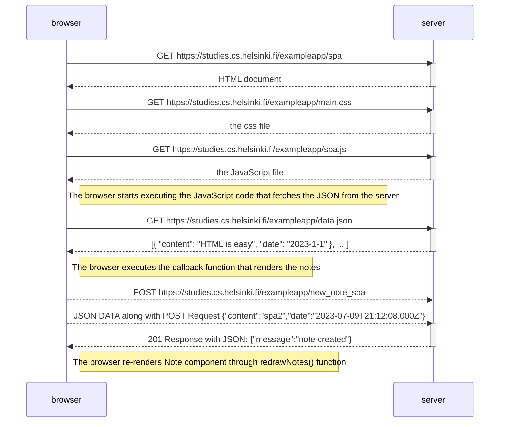

```mermaid
sequenceDiagram
    participant browser
    participant server

    browser->>server: GET https://studies.cs.helsinki.fi/exampleapp/spa
    activate server
    server-->>browser: HTML document
    deactivate server

    browser->>server: GET https://studies.cs.helsinki.fi/exampleapp/main.css
    activate server
    server-->>browser: the css file
    deactivate server

    browser->>server: GET https://studies.cs.helsinki.fi/exampleapp/spa.js
    activate server
    server-->>browser: the JavaScript file
    deactivate server

    Note right of browser: The browser starts executing the JavaScript code that fetches the JSON from the server

    browser->>server: GET https://studies.cs.helsinki.fi/exampleapp/data.json
    activate server
    server-->>browser: [{ "content": "HTML is easy", "date": "2023-1-1" }, ... ]
    deactivate server

    Note right of browser: The browser executes the callback function that renders the notes
    browser-->>server: POST https://studies.cs.helsinki.fi/exampleapp/new_note_spa
    browser-->>server: JSON DATA along with POST Request {"content":"spa2","date":"2023-07-09T21:12:08.000Z"}
    activate server
    server-->>browser: 201 Response with JSON: {"message":"note created"}
    deactivate server
    Note right of browser: The browser re-renders Note component through redrawNotes() function

```
